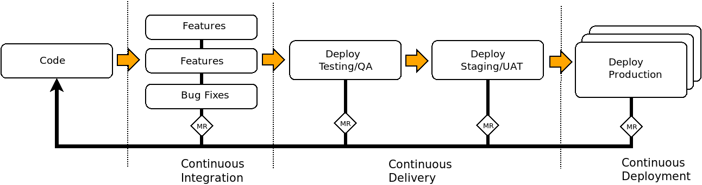

## Code Management

##### A GitPitch Feature Tour

* Best practices
* Recommendations
* Examples

---

## Problem

- Target of multiple datacenters
- How do we organize ci/cd to deliver this?
- Workflows?

---

## Problem - Hotfixing

- Use of Support/Control VMs to do dev/hotfixing
- Necessary but obviates the review/QA processes
- Has become the *de-facto* way of working

---

## Problem - Hotfixing

- Logged on as `dtadmin`
- Changes left on Control VMs, not committed back into git.
- Lost work. Has to be redone later

---

## Problem - Hotfixing

- Changes outside of `git` project potentially pulled in to deployment
- Undesired changes made to environment (production)!!
- Potentially not noticed, changes baked into environment

---

## Problem - Hotfixing

- Logged on as `dtadmin`
- Commiting straight into the `master` branch
- OK, but what about review/traceability?
- Commits made as `dtadmin` user??

---

## Problem - Hotfixing

- Multiple engineers sharing the same git workspace
- One engineer wants to change branch, breaks everybody else
- Potentially not noticed, changes baked into environment

---

## Problem - Hotfixing

- Insufficient review
- Insufficient testing

---

## Problems

- Use of Support/Control VM to do dev/hotfixing
- Commiting straight into the `master` branch
- Multiple engineers sharing the same git workspace
- Changes not being committed back to git
- Insufficient testing

---

## Slide Fragments
Press Down key for examples. |

See [GitPitch Wiki](https://github.com/gitpitch/gitpitch/wiki/Fragment-Slides) for details.

+++

## Version Control - Branches

Git do's

- Prepare changes in topical branches |
- Commit early/often with small, logical commits |
- Reverts, cherry-picks, etc are simpler - as is testing/intuition.
- Commit often, perfect later - but publish once |
- Commit completed changes |
- Test before you commit - fail early |
- Test before you merge |
- Test after you merge?? |
- Commit binaries into source code (use Artifactory!! or Swift/Ceph!!) |

+++

Branches Do's

- Use private repositories for features-in-dev/experimental |
- Did you know about gitlab user repositories? |
- https://gitlab.tools.in.pan-net.eu/$username? |
- Mark your merge request as a WIP: until you're ready to merge |
- Write nice commit messages |
- Make use of smart commits |

+++

Branches Dont's

- Work on the master branch |
- Why? You should be able to context switch between dev and hotfixing. |
- Combine multiple unrelated changes into a single commit |
- Write commit message titles > 50 chars |
- Never change published history |
- Change published tags |
- Work within the GitLab UI |
- Pull before you push |

---

## Branching models

Branches are small, short-lived.
Feature selection/integration for release should happen at any time.
Where does integration happen? Into the production branch?????
Remember that feature may not be selected for release
were unrealistic/expensive, too risky, were experiments

Many models exist, which to choose for a team requires consideration.

+++

## Branching models ...

- Should support the release management processes
- Should support deployments at any time - disaster recovery
- Should support QA at every stage

+++

## Branching models ...

- Consideration: What are the important phases of your delivery lifecycle?
- Process-mature teams ensure that code goes through gates
- Feature/spring planning
- Selected-for-development
- Selected-for-integration
- Released-to-testing (integration->regression testing)
- Released-to-staging
- Released-to-production

+++

## Branching models ...

- Can you port groups of related change?
- Can a hotfix (quick and dirty) be formally backported into next release?
- Can you forward port a feature-in-development to a hotfix? Circumventing QA?
- Can you manage all of this one one branch?
- *Unlikely*

+++

## Branching models ...

- How do you do rollbacks?
- In code, you deploy from the previous last-known-good-tag.
- In infrastructure, you need to test the rollback.

+++

## Branching models ...

- How do you do hotfixes?

+++

## Branching models ...

- How should branches be named?
- *master*
- `develop`
- _feature/31-support-api-logging_
- **hotfix/42-fix-api-auth**
- ``release/v1.2.3``

+++

## Branching models ...

- What is the lifecycle of a branch?

---

## IaC best practices

- Treat all infrastructure as code |
- The code is the authority/source of truth |
- If the infrastructure tells a different story, a hotfix is needed |
- Does your codebase tell a story? It should, a healthy one |
- How do you improve the health of a codebase? |
- Testing, More Testing, code review, better practices |
- Allow rollbacks - things can go wrong |
- Allow for hotfixing and development to happen simulatenously |
- Use a workflow that supports your release strategy |
- is a single branch model the best for your team? |
- *Quite unlikely* |

---

## Release management

### Release readiness

- Test, test, test - has everything gone green. Really green??
- Generate release notes - high-level summary of changes
- Generate a CHANGELOG - what you would want your peers to see
- Tag your release commit appropriately
- Deploy from the tag
- Generate a release notification

---

### Versioning

Why? Makes communications easier.

- Alice: Hi Ted, We noticed a problem in production ... |
- Ted:   Ok, What version are you using? |
- Alice: Version 13619bd |
- Ted:   Yea, we had to hotfix that version, please move to 13619bd |
- Pointy-Haired Boss: What in ....'s name? |

+++

- Alice: Ok, but what changed in `db91631` ??
- Ted:   I have no time for this .. please `git log db91631` |
- Alice: It says, `overlay-orange#188 Fixing gobbledegook() in the foobar module` |
- Ted:   Yes? And? |
- Alice: I have no idea what that means .. |
- Alice: Do I need to re-test all my application? Or just the integration? |
- Ted:   How do I know? Does your application make use of `foobar`? |
- Alice: No. |
- Pointy-Haired Boss: %*!$£** |

+++

Alice: Hi Ted, We noticed a problem with `service foo v1.2.3` in production ...
Ted:   I see, but `v1.5.1` is current.

Pointy-Haired Boss: Alice, `v1.5` introduced changes to behaviour X ..
Alice: I see, OK, We shall try upgrading to `v1.5.1` ..

Pointy-Haired Boss: You will have to upgrade to `v1.4` first ..
Alice: I see. Thanks!! Wally, please upgrade in TestEnv1 and run a sanity test.

Wally: Done!! Two issues were raised, feature changes were prepared and ready to merge.
Alice: Ok, please merge them into `develop` and run the full regression test.

Publishing change/change-sets

- Use git tags on the `master` branch
- Deploy code from a tag.
- Why? Because `13619bd` means what. `v2.3.456` is better.
- Especially true if your code has downstream consumers.
- Recommendation: Make use of [Semantic Versioning 2.0.0](https://semver.org/)

+++

Authors |

- Use tags on your `master` branch to signal downstream change.
- Tags must be of the form `<major-version>.<minor-version>.<patch-version>`.
- Encourage your users/downstream teams to use your tagged.
- Know your rollback procedure i.e. `deploy-script --version v1.2.2`
- Know your hotfix procedure i.e. `git checkout tags/v1.2.3 -b hotfix/broken-api`

+++

User

+++

Example manifest for ansible-galaxy

@[1](Specify your dependency)
@[3](Specify the version of the dependency)
@[5-6](Dependency may come from another source)
@[9-14](Python for..else statement)

---
