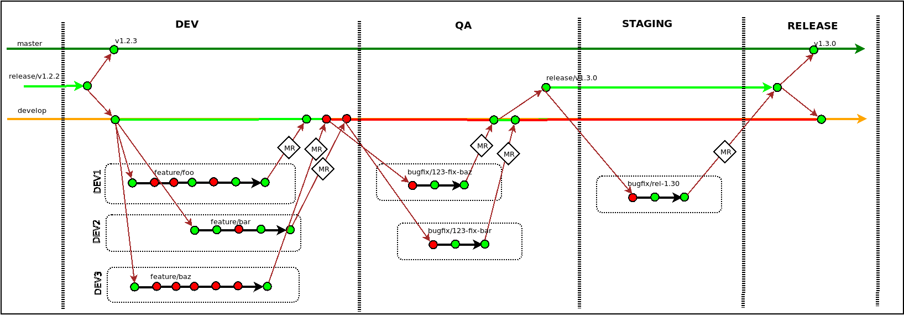
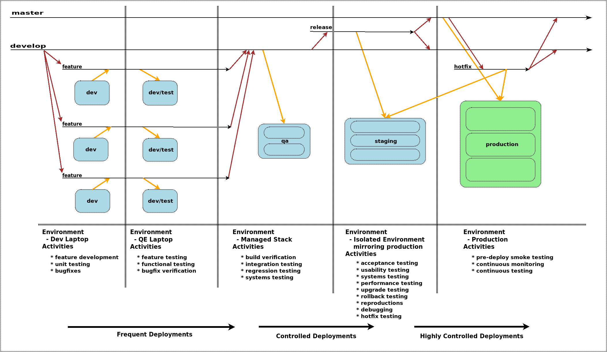

# <span style="font-family:Helvetica Neue; font-weight:bold">
<span style="color:#e49436">Infrastructure</span> as Code</span>

* Problems
* Best practices & Recommendations
* Examples, Demos

---

## Infrastructure As Code

Is it this?


+++

## Infrastructure As Code

Or this?


+++

## Infrastructure As Code


+++

## Infrastructure As Code


- Delivery Target of multiple datacenters
- What are the current problems?
- How do we organize CI/CD to deliver this?

+++

## IaC - Generally accepted practices

- All deployments must be driven through code |
- The code is the authority/source of truth |
- The code base allows for multiple engineering activities |
- Dev, Test, Hotfixing - no one activity should be blocked |
- All pipeline activities must be transparent |
- Production deployments must be effortless/consistent/automated |
- Delivery pipeline should support a "Fail Fast/Fail Early" strategy |
- All deployments must be repeatable, reliable |

---

## Current problems

- We are only beginning IaC journey - problems expected
- Problems noticed through observation
- Not everyone contributes to the problems
- Some problems are not obvious

---

## Problem - Dev on ControlVM


- Use of Control VMs to do dev/hotfixing |
- Has unfortunately become the de-facto way of working. |
- Not IaC!!! Opaque, Short-circuit to production |

+++

## Problem - Lost work


- All engineers logged on as the dtadmin user |
- Changes left on Control VMs, not committed back into git |
- Lost work. Has to be redone later |
- Not IaC!!! Repetition |

+++

## Problem - Shared workspace


- Multiple engineers sharing the same git workspace |
- One engineer wants to change branch, breaks everybody else |
- Potentially not noticed, changes baked into environment |
- Not IaC!!! Production state differs from code |

+++

## Problem - Undesired state


- Unhygienic environment on ControlVM |
- Undesired changes potentially pulled in by deploy scripts |
- Potentially not noticed, changes baked into environment |
- Not IaC!!! Production state differs from code |

+++

## Problem - Use of master branch


- Commiting straight into the master branch |
- Often as the dtadmin/root user |
- OK, but what about review/traceability? |
- Not IaC!!! Circumvents review/QA |

+++

## Problem - Insufficient testing


- Insufficient review |
- Insufficient testing |
- Not IaC!!! More hotfixing than usual QA-centric delivery |

+++

## Recommendations

+++


- Protect the production/master branch |
- Ensure production/master branch always reflects production state |

+++


- Use a staging/develop branch to collect MRs |
- Make this the default branch |
- Make use of a QA/Test env. for cont. integration/testing |
- Make use of a staging env. for release readiness |

+++


- If deployment is found to differ from code, hotfix right away |
- Ensure all Merge-Requests are reviewed |
- Recommend all commits are tested |

+++


- Publish guidance on use of dtadmin user - use sparingly |
- Changes to ControlVM should ideally be avoided |
- Changes to ControlVM should accompany change review |

---

## Version Control - Branches

---

## Problem - Single master branch


- Best intentions but problems still arise.
- At scale this is problematic
- Customers can feel the problems and your hotfixing activities

+++


- Better approach
- Buffer between internal churn and production/customers
- But develop/integration branches are typically unstable

+++



- Even better approach
- Releases branches can be stabilized in a sandbox
- Changes are integrated back into iteration

+++


- Hotfixing is done in a sandbox
- Changes are integrated back into iteration

+++



- What we result in

---

### Versioning

- Why? Facilitates communication about public APIs/releases
- Downstream users know how to react to changes.
- Ensures manifested deployments to environments.

+++

### Example manifest

```yaml
- src: git@gitlab:project-x/module-foo.git
  scm: git

- src: git@gitlab:project-y/module-bar.git
  scm: git

- src: git@gitlab:project-z/module-baz.git
  scm: git
```

- Which branch?
- Master? Are you sure?
- What happens on the next deployment?

@[2,5,8](Branch as version)

+++

```yaml
- src: git@gitlab:project-x/module-foo.git
  version: master
  scm: git

- src: git@gitlab:project-y/module-bar.git
  version: master
  scm: git

- src: git@gitlab:project-z/module-baz.git
  version: master
  scm: git
```

- OK. This is better.
- What happens on the next deployment?

@[2,6.10](Branch as version)

+++

```yaml
- src: git@gitlab:project-x/module-foo.git
  version: 15e5f08
  scm: git

- src: git@gitlab:project-y/module-bar.git
  version: 3a21d57baf60cec60d555b984f740e90c9b0c011
  scm: git

- src: git@gitlab:project-z/module-baz.git
  version: ee474c7347ad7ca30739dd897d6796ecc41e590f
  scm: git
```

- Much better.
- Fixed reliable/repeatable deployments achieved.
- But!! Which "version" are you using?
- If you know, do your downstream users know?
- How do you measure lag?

@[2,6.10](Commit ID as version)

+++

```yaml
- src: git@gitlab:project-x/module-foo.git
  version: v1.2.3
  scm: git

- src: git@gitlab:project-y/module-bar.git
  version: v3.5.78
  scm: git

- src: git@gitlab:project-z/module-baz.git
  version: v0.1.0-alpha1
  scm: git
```

- Much better.
- Better transparency/intuition - http://semver.org/

@[2,6.10](Version numbers as version)
@[4](Version numbers as a well-formed version)
@[6](Branch as version)
@[10](Branch as version)

+++

## Versioning - Recommendations

- Use git tags on the `master` branch
- Recommendation: Make use of [Semantic Versioning 2.0.0](https://semver.org/)
- Deploy code from a tag.
- Why? Because `13619bd` means what. `v2.3.456` is better.
- Especially true if your code has downstream consumers.

